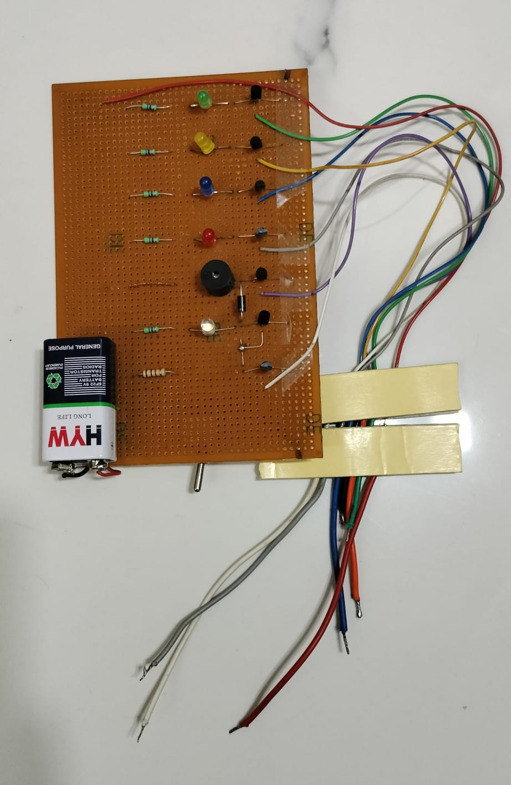
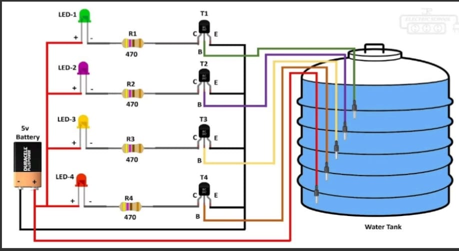

<p align="center">
  
</p>

<h1 align="center">💧 Water Level Indicator</h1>

<p align="center">
A hardware-based Water Level Indicator that detects and displays water levels using the electrical conductivity of water. The system uses BC547 transistors, LEDs, and a buzzer to provide real-time water level monitoring without using any microcontroller.
</p>

---

## 📖 Project Overview

Water overflow and dry water tanks are common problems in homes and industries. This project provides a simple, reliable, and cost-effective solution for monitoring the water level inside a tank.

As the water level rises, it completes electrical paths between sensing probes. These signals activate BC547 transistors, which switch ON LEDs corresponding to different water levels. When the tank reaches its maximum level, a buzzer is activated to alert the user.

This project demonstrates the practical application of transistor switching circuits and the electrical conductivity of water.

---

## ✨ Features

- 💧 Real-time water level indication
- 💡 LED indication for different water levels
- 🔔 Buzzer alert when the tank is full
- ⚡ Simple transistor-based circuit
- 🚫 No programming required
- 🤖 No microcontroller used
- 💰 Low-cost and easy-to-build design
- 🎓 Suitable for educational and demonstration purposes

---

## 🛠 Components Used

| Component | Quantity |
|-----------|----------|
| BC547 Transistor | 4 |
| LEDs | 4 |
| Resistors | As required |
| Buzzer | 1 |
| 9V DC Power Supply | 1 |
| Connecting Wires | As required |
| Water Tank with Metal Probes | 1 |

---

## ⚙️ Working Principle

The project works on the **electrical conductivity of water**.

1. Metal probes are placed at different heights inside the water tank.
2. As the water level rises, it connects the common probe with the corresponding sensing probe.
3. A small current flows into the base of the respective BC547 transistor.
4. The transistor switches ON the corresponding LED.
5. When water reaches the highest probe, the buzzer is activated, indicating that the tank is full.

The entire system operates without any microcontroller or software, making it simple, reliable, and easy to understand.

---

## 📷 Project Images

### Prototype

<p align="center">
  
</p>

---

### Circuit Diagram

<p align="center">
  
</p>

---

## 📄 Project Documentation

The complete project report is available here:

📘 **[Water Level Indicator Report](water-level-indicator.pdf)**

---

## 🎯 Applications

- 🏠 Domestic water tanks
- 🏢 Overhead water storage tanks
- 🏭 Small-scale industries
- 🎓 Electronics laboratory experiments
- 📚 Educational hardware projects

---

## 🚀 Future Improvements

Future enhancements can include:

- Arduino or ESP32 integration
- LCD/OLED display for water level
- IoT-based remote monitoring
- Automatic water pump ON/OFF control
- Mobile application notifications
- Wireless monitoring system

---

## 📚 Technologies Used

- Analog Electronics
- Transistor Switching Circuits
- Basic Electronic Components
- Hardware Circuit Design

---

## 📁 Repository Contents

```text
Water-Level-Indicator/
│
├── README.md
├── water-level-indicator.pdf
├── project-photo.jpeg
└── circuit-diagram.jpeg
```

---

## 👩‍💻 Author

**Vidhi Sevaramani**

B.Tech Student in Electronics Engineering

Passionate about Electronics, Robotics, Embedded Systems, IoT, and Hardware Project Development.

---

## ⭐ Support

If you found this project helpful or interesting, please consider giving this repository a **⭐ Star**.

Thank you for visiting this repository!
